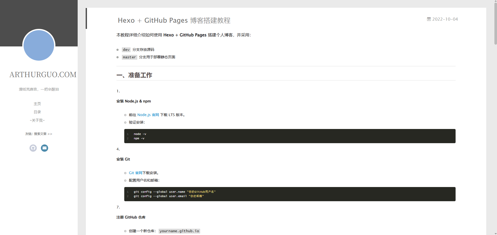

# 

本教程详细介绍如何使用 **Hexo + GitHub Pages** 搭建个人博客，并采用：
- `dev` 分支存放源码
- `master` 分支用于部署静态页面

---



<!-- more -->

## 一、准备工作

1. **安装 Node.js & npm**
   - 前往 [Node.js 官网](https://nodejs.org/) 下载 LTS 版本。
   - 验证安装：
     ```bash
     node -v
     npm -v
     ```

2. **安装 Git**
   - [Git 官网](https://git-scm.com/)下载安装。
   - 配置用户名和邮箱：
     ```bash
     git config --global user.name "你的GitHub用户名"
     git config --global user.email "你的邮箱"
     ```

3. **注册 GitHub 仓库**
   - 创建一个新仓库：`yourname.github.io`
   - `master` 分支：部署静态页面
   - `dev` 分支：存放源码【**设置成默认分支**】

---

## 二、安装 Hexo
1. 全局安装 Hexo：
   ```bash
   npm install -g hexo-cli
   ```

2. 初始化博客：
   ```bash
   hexo init blog
   cd blog
   npm install
   ```

3. 本地运行：
   ```bash
   hexo s
   ```
   打开 `http://localhost:4000` 查看。

---

## 三、配置分支策略
### 1. 初始化仓库
```bash
git init
git remote add origin https://github.com/yourname/yourname.github.io.git
```

### 2. 创建 `dev` 分支并推送源码
```bash
git add .
git commit -m "init hexo blog"
git push origin dev
```

---

## 四、安装部署插件
```bash
npm install hexo-deployer-git --save
```

编辑 `_config.yml`：
```yaml
deploy:
  type: git
  repo: https://github.com/yourname/yourname.github.io.git
  branch: master
```

---

## 五、生成并部署到 master

```bash
hexo clean
hexo g
hexo d
```

【坑1:】在 **dev** 分支的本地仓库里设置了 `user.name` 和 `user.email`，但 Hexo 部署 `hexo d`仍然会报错。原因：

Hexo-deployer-git 在执行 `hexo d` 时，会在项目根目录下生成一个 **临时 Git 仓库**：

```
.deploy_git/.git/
```

- 这个仓库独立于你的 dev 分支仓库，所以 **它不会继承你在 dev 分支里配置的 user.name / user.email**。

**解决方法**

出错后，你需要为 **`.deploy_git` 临时仓库** 配置身份，提交一次即可：

```
cd blog/.deploy_git
git config user.name "your_name"   #【只设置一次】
git config user.email "your_email@example.com" #【只设置一次】
cd ..
hexo d
```


---

## 六、GitHub Pages 配置
1. 打开仓库 → Settings → Pages
2. Source 选择 `master` 分支
3. 等待几分钟即可通过 `https://yourname.github.io` 访问

---

## 七、写文章流程
```bash
hexo new "文章标题"
# 编辑 source/_posts/文章标题.md
hexo g
hexo d
git add .
git commit -m "update blog"
git push origin dev
```

---

## 八、换电脑操作

1. 克隆源码：
```bash
git clone -b dev https://github.com/yourname/yourname.github.io.git blog
cd blog
```

2. 安装依赖：
```bash
npm install
```

3. 本地运行：
```bash
hexo s
```

---

## 九、日常维护操作

### 1. 写新文章
```bash
hexo new "文章标题"
```

### 2. 本地预览
```bash
hexo s
```

### 3. 部署博客
```bash
hexo clean
hexo g
hexo d
```

### 4. 提交源码
```bash
git add .
git commit -m "update: 新文章"
git push origin dev
```

---

## 🔄 一键部署脚本

新建 `deploy.sh`：
```bash
#!/bin/bash
git add .
git commit -m "update: $(date '+%Y-%m-%d %H:%M:%S')"
git push origin dev
hexo clean
hexo g
hexo d
```

赋予权限：
```bash
chmod +x deploy.sh
```

以后只需运行：
```bash
./deploy.sh
```

---

## 📌 总结
- **dev 分支**：存放源码
- **master 分支**：静态页面
- **换电脑**：clone `dev` 分支 + `npm install`
- **日常维护**：写文章 → 预览 → 部署 → 提交源码
